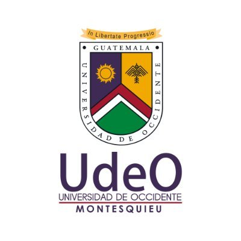

# UDEOASIS
Creación de Sistema de Control de Asistencia sobre la Identificación Estudiantil usando QR para la Universidad de Occidente, Extension Montesquieu Zona 12 de la Ciudad de Guatemala

# Desarrolladores:
- Nombre: David Joaquin Ramirez Muñoz
- Carné: 1904002003

- Nombre: Edvin Estuardo Pérez Garcia
- Carné: 1904002011
## UDEO

>[!IMPORTANT]
> Este repositorio esta desitando para el curso de Seminario 
